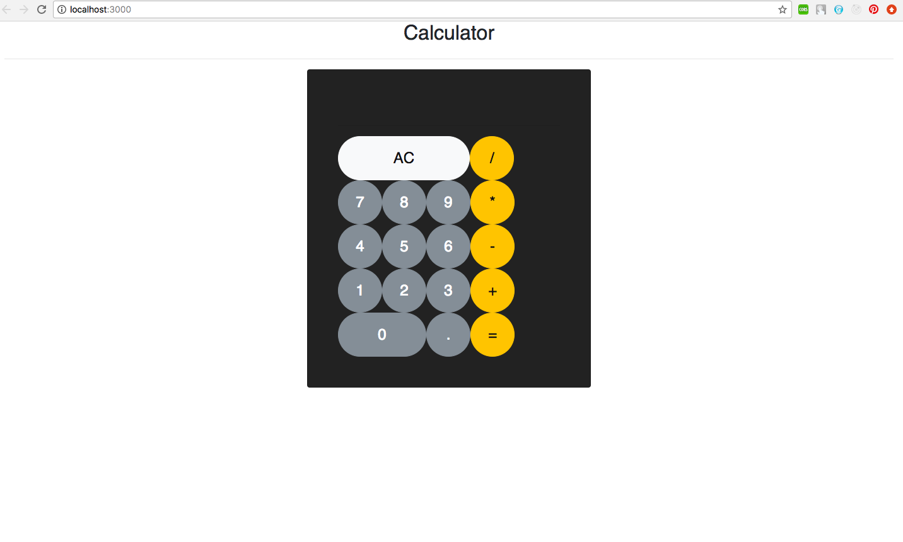

# Calculator

Calculator App using technologies:

• Frontend: ReactJs  
• Backend:  node.js

Features: 

• Add  
• Subtract  
• Multiply  
• Divide  
• Follows BODMAS rule on multiple operations

Steps to run the application:

Backend:
1. cd CalculatorReact_Server
2. npm install
3. npm start

Frontend:
1. cd CalculatorReact_UI
2. npm install
3. npm start

Below are some screenshots demonstrating the application:

### Welcome Page

### Performing Operations

